## Cube

如果直接运行Cube，你可以使用如下参数：

```powershell
python main.py CUBE
```

如果直接打开，会得到这样的一个场景：

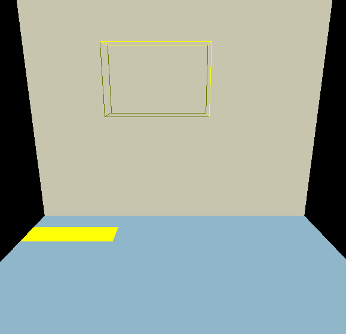

这是因为你还没有填写任何矩阵！你需要去`box_scene.py`中，填写完整对应的矩阵。

这一作业需要经过三步。第一步是填充全局变换矩阵`B1_World`、`B2_World`、`B3_World`，可以使用如下的命令只运行步骤1：

```powershell
python main.py CUBE -p 1
```

如果你计算正确的话，会得到一个线框场景，如下所示：

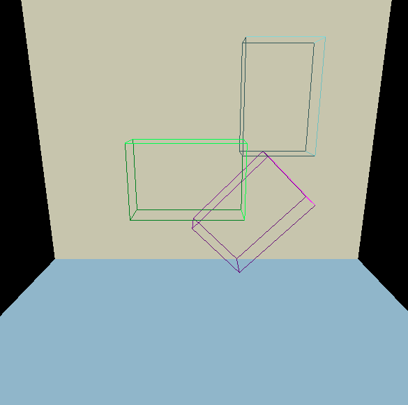

第二步是填充局部变换矩阵`B1_local`、`B2_local`、`B3_local`，可以通过如下指令只运行到步骤2：

```powershell
python main.py CUBE -p 2
```

如果你计算正确的话，你应该得到下面的图形，立方体被填充到了格子中：

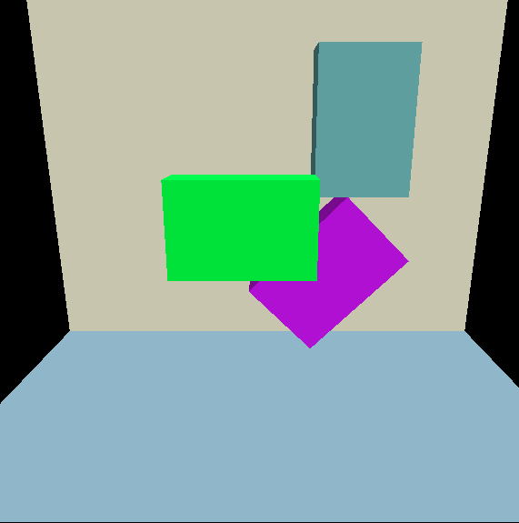

最后是进行移动操作，你需要填写目标位置相对于B2坐标系下的变换矩阵`B2TransformMatrix`。可以通过如下指令运行到第三个步骤：

```powershell
python main.py CUBE -p 3
```

最终，你应该得到如下图形：

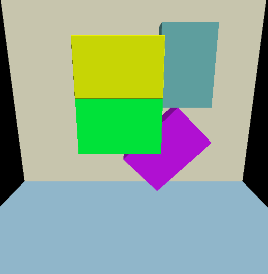

## FK

这一作业需要你实现正向动力学。运行FK可以通过这样的方式：

```powershell
python main.py FK
```

这样系统会默认打开 `resources\Thief.bvh`。在resources文件下，还提供了一系列文件，你可以通过 `-f`参数来指定：

```powershell
python main.py FK -f ./resources/Destroy.bvh
```

如果你直接运行，会看到这样的场景：

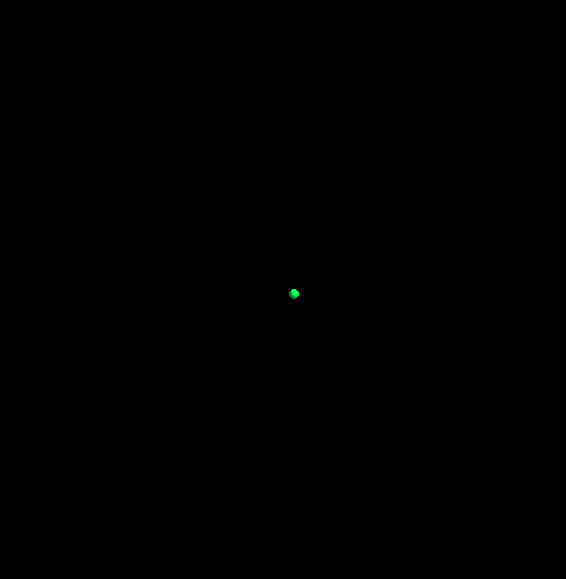

这是因为骨架信息还没有进行解算，而这正是你需要实现的！在 `FK.py`中，填写完成`update_fk`函数，如果填写正确的话，你会得到下面的结果：

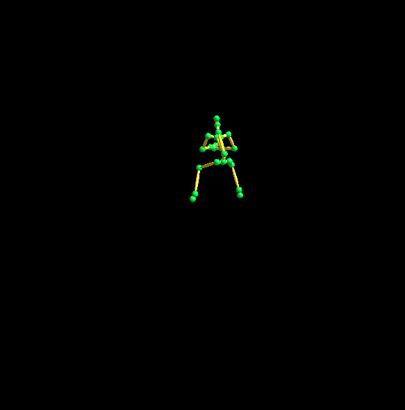

一个人形的骨架将会执行一些偷窃动作。

## IK

完成该作业需要先完成FK。

IK可以从一个BVH的任意一帧开始进行解算，否则会对默认骨架信息解算。这一帧由参数 `-s`指定，例如：

```shell
python main.py IK   # 对Thief.bvh的默认骨架信息进行解算
python main.py IK -s 20 # 对Thief.bvh的20帧骨架位置进行解算
python main.py IK -f ./resources/TPose.bvh # 对TPose.bvh的默认骨架信息进行解算
python main.py IK -f ./resources/TPose.bvh -s 10 # 对TPose.bvh第10帧时候的骨架信息进行解算
```

在运行时，你可以通过鼠标右键选择你的目标关节，然后拖动左键选择该关节的目标位置。此时，目标匹配的关节会变成红色，所有受影响的关节会变成浅蓝色，上面的关节变成紫色。在没有填写IK的情况下，你会看到如下结果：

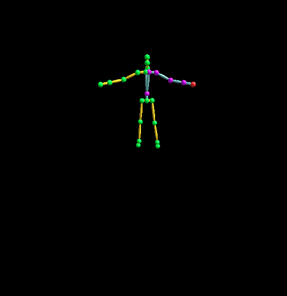

你可以选中目标关节和拖动鼠标，但骨骼并不会随着你的鼠标运动。你需要填写 `IK.py`中的 `solve_ik`函数，如果实现正确的话，你可以让骨骼来尽可能的匹配到目标位置：

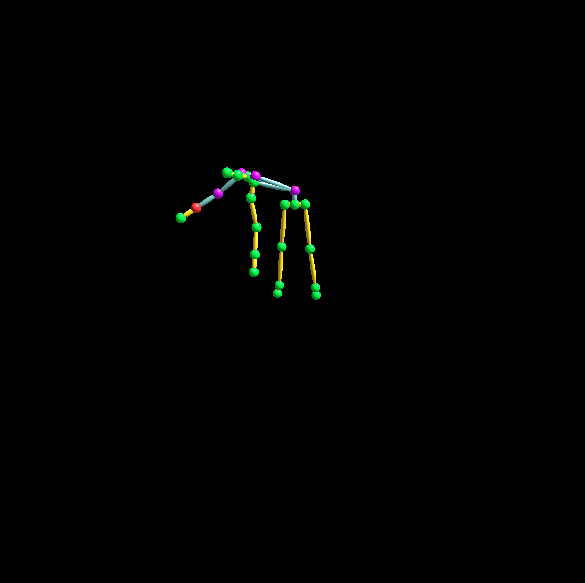

下面是你可能用到的函数：

- `get_position_from_matrix` 从`mat4`获取位置坐标
- `get_rotation_from_matrix` 从`mat4`获取旋转矩阵
- `axis_angle_to_mat3` 从轴角数对转换为mat3
- `construct_transform_matrix` 根据旋转矩阵和位置信息建立`mat4`
- `A.transpose()` 对一个矩阵`A`进行转置
- `tm.normalize` 对向量归一化
- `tm.acos()` 求解$\arcsin$值
- `tm.cross()` 求解叉积结果

## Blend

动画融合发生在两个动画片段之间。下面展示了一个动画融合的过程：

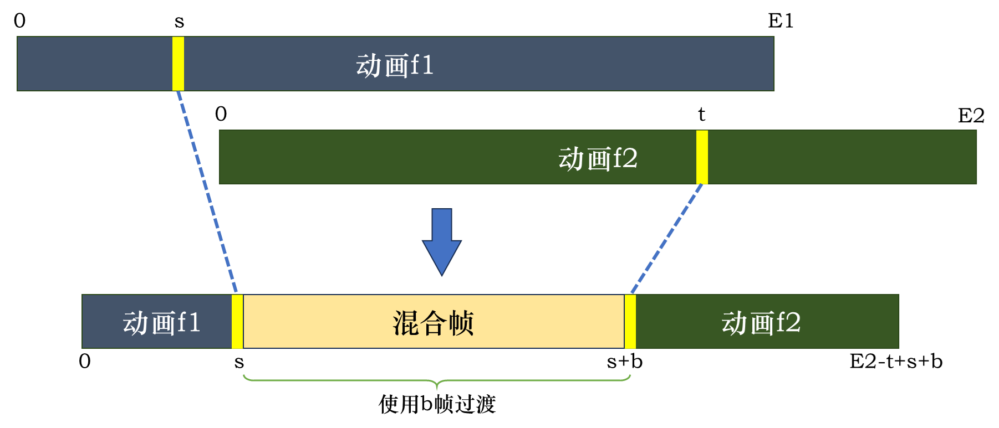

可以看到，将两个动画片段融合起来，就相当于将动画片段1的$[0,s]$和动画片段2的$[t,f]$做了一个连接，然后中间引入了一些过渡帧。因此，动画融合需要如下参数的指定：

- `-f1`, `--file1`，指定动画1
- `-s`，`--frame`，指定动画1的开始混合帧
- `-f2`，`--file2`，指定动画2
- `-t`，`--frame2`，指定动画2的开始混合帧
- `-b`，`--blendcnt`，指定过渡需要的帧数
- `-m`，`--blendmethod`，指定过渡使用的插值方式，需要是SLERP、CUBIC或SQUAD之一

下面是一个典型的调用，这个例子从`FrightenWalk`的第10帧用20帧过渡到`Thief`的第260帧，采用SLERP的方式：

```shell
python main.py BLEND -f1 .\resources\FrightenWalk.bvh -s 10 -f2 .\resources\Thief.bvh -t 260 -b 20 -m SLERP
```

这里需要特别小心的是，我们希望完成根节点上运动的**匹配**：

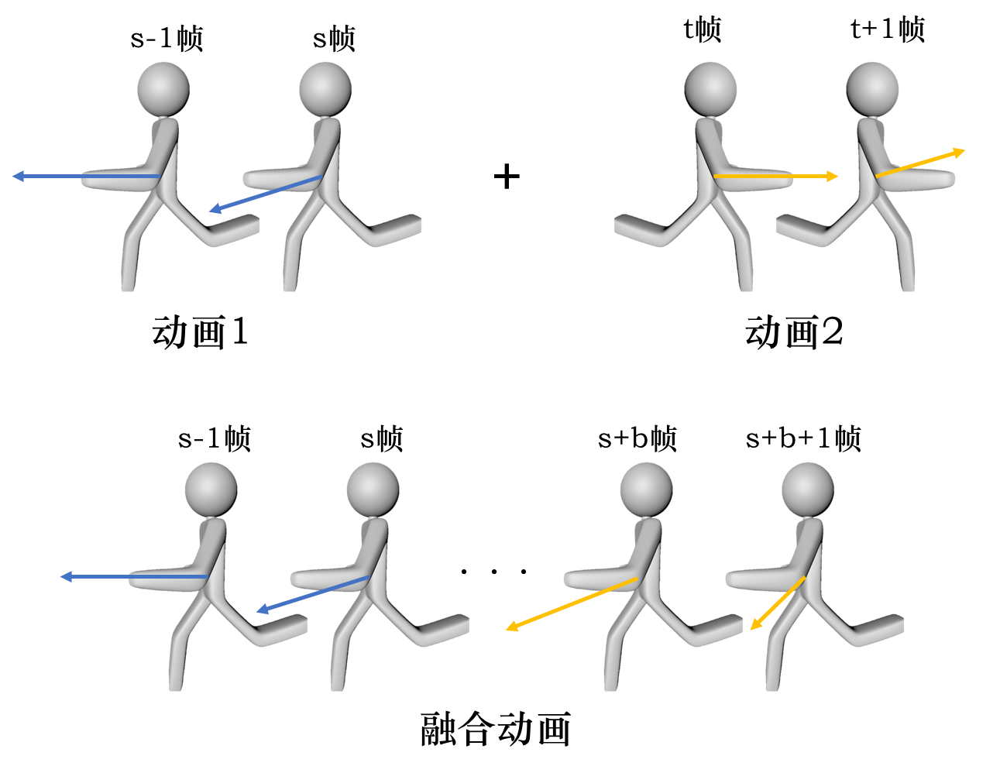

像上面的两个运动的小人，动画1中，小人的运动是向左的；而动画2中则是向右的。我们希望的是**动作**上的融合，也就是除去根节点外各个关节的平滑过渡；但对于根节点来说，我们希望保持一种一致性，维持方向的不变。更一般化的，假设动画1在$s$帧人物旋转是$\mathbf{R}_{s}$，第$t$帧人物旋转是$\mathbf{R}_{t}$，我们希望对动画2的所有矩阵都应用一个$\mathbf{R}_s (\mathbf{R}_t)^{-1}$，这样能保证动画2的第t帧人物朝向和动画1的第s帧人物朝向相同。

还需要考虑速度的问题。假设动画1的s-1和s帧根节点位置是$\mathbf{p}_{s-1}$和$\mathbf{p}_s$，动画2的t帧和t+1帧根节点位置是$\mathbf{p}_t$和$\mathbf{p}_{t+1}$，每帧的时长是$\Delta t$，那么动画1的该帧速度是$\mathbf{v}_1$，动画2的该帧速度是$\mathbf{v}_2$，于是利用差分近似导数，得到
$$
\mathbf{v}_1 = \frac{\mathbf{p}_{s} - \mathbf{p}_{s-1}}{\Delta t}, \mathbf{v}_{2} = \frac{\mathbf{p}_{t+1}-\mathbf{p}_{t}}{\Delta t}
$$
由于在匹配运动之后，二者的速度方向是一致的，因为速度方向与朝向相同。为此，在中间的补帧过程中，应该在$\mathbf{v}_1$的方向上运动$\dfrac{|\mathbf v_1|+|\mathbf v_2|}{2}$，才能保证连续性。假设在融合后的动画中，$\mathbf{p}_t$的位置是$\mathbf{p}_t'$，一共补$b$帧，那么
$$
\mathbf{p}_t' = \mathbf{p}_s+\left(\dfrac{|\mathbf v_1|+|\mathbf v_2|}{2}\right)\cdot \frac{\mathbf{v_1}}{|\mathbf{v_1}|}\cdot b\Delta t =\mathbf{p}_s+b\frac{|\mathbf{p}_{s} - \mathbf{p}_{s-1}|+|\mathbf{p}_{t+1}-\mathbf{p}_{t}|}{2}\cdot\frac{\mathbf{p}_s-\mathbf{p}_{s-1}}{|\mathbf{p}_s-\mathbf{p}_{s-1}|}
$$
假设原本动画2的第$t$帧人物位于$\mathbf{p}_t$，第$q(q>t)$帧人物位于$\mathbf{p}_q$，我们还需要把旋转应用到根节点上，也就是
$$
\mathbf{p}_q'=\mathbf{R}_s\mathbf{R}_t^{-1}(\mathbf{p}_q-\mathbf p_t)+\mathbf{p}_t'
$$
对于每个关节的插值，可以把旋转和位置分开讨论。位置可以用简单的线性插值实现：
$$
\operatorname{lerp}(\mathbf{x},\mathbf{y},t)=(1-t)\mathbf{x}+t\mathbf{y}
$$
在`taichi.math`中，提供了函数`mix`完成线性插值。而对于旋转，如果直接使用欧拉角，则会导致万向节死锁等问题；因此这里提供了三种方式：

- SLERP，四元数的球面插值$\operatorname{slerp}(\mathbf{q}_0,\mathbf{q}_1,t)$
- CUBIC，对欧拉角进行三次样条插值$\operatorname{cubic}(\mathbf{a}_{-},\mathbf{a}_0,\mathbf{a}_1,\mathbf{a}_+,t)$。这一算法需要额外补充动画1的上一帧和动画2的下一帧的欧拉角$\mathbf{a}_-,\mathbf{a}_+$用于更平滑的插值。
- SQUAD，四元数的三次球面样条插值。SQUAD的算法较为复杂，有兴趣可以看[这篇博客](https://blog.csdn.net/shao918516/article/details/109738930)来了解相关数学背景。最终，你应该使用的函数是$\operatorname{squad}(\mathbf{q}_0,\mathbf{s}_0,\mathbf{s}_1,\mathbf{q}_1,t)$，其中$\mathbf{s_0},\mathbf{s_1}$是函数`calc_squad_control`计算出的控制点。

下面对动画融合的整个代码结构进行介绍。它的核心实现位于`Blend.py`中，主要分成两个步骤：

- **预处理**。在预处理过程中，首先计算动画2在融合后的位置和需要应用的旋转矩阵，然后将开始帧和结束帧的信息写入到field中。假设动画1在帧s开始过渡，过渡到动画2的帧t，这里有几个可能用到的field：

  - `pre_mat` 动画1的帧s-1的所有关节的变换矩阵
  - `start_mat` 动画1的帧s的所有关节的变换矩阵
  - `end_mat` 动画2的帧t的所有关节的变换矩阵
  - `post_mat` 动画2的帧t+1的所有关节的变换矩阵

  于此同时，会用到下面几个kernel：

  - `make_up_post_motion` 计算根节点的旋转矫正矩阵和新的位置。
  - `modify_root_transform` 将帧t的计算结果运用到动画2的后续帧中。
  - `calc_squad_control` 如果使用SQUAD的插值方式，需要计算控制点。

- **当帧计算**。对于当前时刻$t$、动画1的过渡开始帧$s$、动画2的过渡结束帧$t$和，有三种情况：

  - $t \le s$，也就是还处于动画1，则直接对动画1进行FK解算
  - $s < t < s+b$，则对融合做解算。它会依据插值方式来调用`blend_anim_slerp`、`blend_anim_cubic`和`blend_anim_squad`之一，然后再调用`update_fk`
  - $t\ge s+b$，则播放动画2.它会首先调用`modify_root_transform`来将变换应用到当前帧的根节点上，然后再对动画2进行FK解算。

下面是你可能用到的一些函数：

- `get_translation` 获取一个`mat4`的位置
- `get_rot_matrix` 获取一个`mat4`的旋转矩阵
- `construct_transform_matrix` 根据旋转和位置构建`mat4`
- `matrix_to_quaternion` 将一个`mat3`的旋转矩阵转换为四元数
- `slerp` 四元数球面插值函数
- `tm.mix` 线性插值函数
- `tm.length` 获得向量长度
- `mat3_to_eular_angle` 根据一个`mat3`获得欧拉角
- `euler_angle_to_mat3` 根据欧拉角获得旋转矩阵

你需要实现`Blend.py`中的三个函数：`make_up_post_motion`、`modify_root_transform`和`blend_anim_slerp`。如果实现正确的话，你应该看到两个动画正确的混合起来：

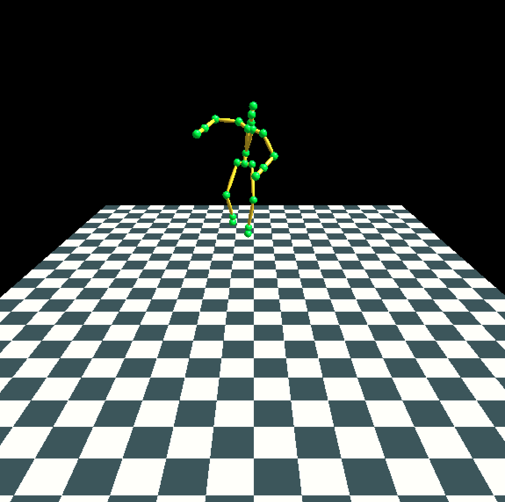

## Rocket

此次作业你需要实现一个粒子系统来模拟火箭发射。运行该系统的代码如下：

```powershell
python main.py ROCKET
```

在运行时，鼠标左键点击窗口将会在点击位置的窗口底部发射一个火箭，火箭升至最高点后爆炸，生成一系列环状火花。你需要实现`Spark.py`和`Rocket.py`的`UpdateState()`、`FindDeriv()`和`ComputeForce()`共计6个函数。

最终，目标成果如下：

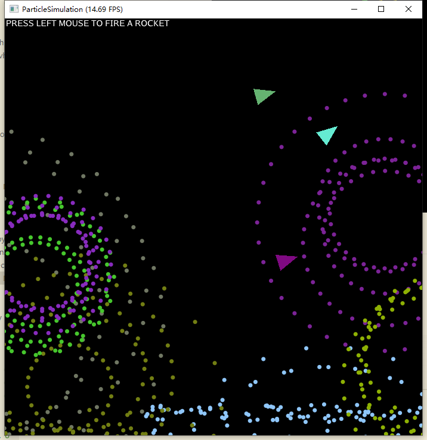

## Crowd

此次作业你需要模拟一个群落的各种行为。运行代码如下：

```shell
python main.py CROWD
python main.py CROWD -n 20 #指定agent数量为20，默认为5
```

在运行时，鼠标右键点击窗口将会将群体追逐目标设定为鼠标点击位置（渲染为红色圆圈）。键盘输入Q、W、E、R、T、Y、U、I、O、P以及空格键将会更改群体行为模式。具体键位与行为模式的对应如窗口顶部所示。你需要实现`Agent.py`中的对应函数来实现相应的行为模式，部分行为模式的代码已经给出。

如果运行正确，你会得到如下结果：

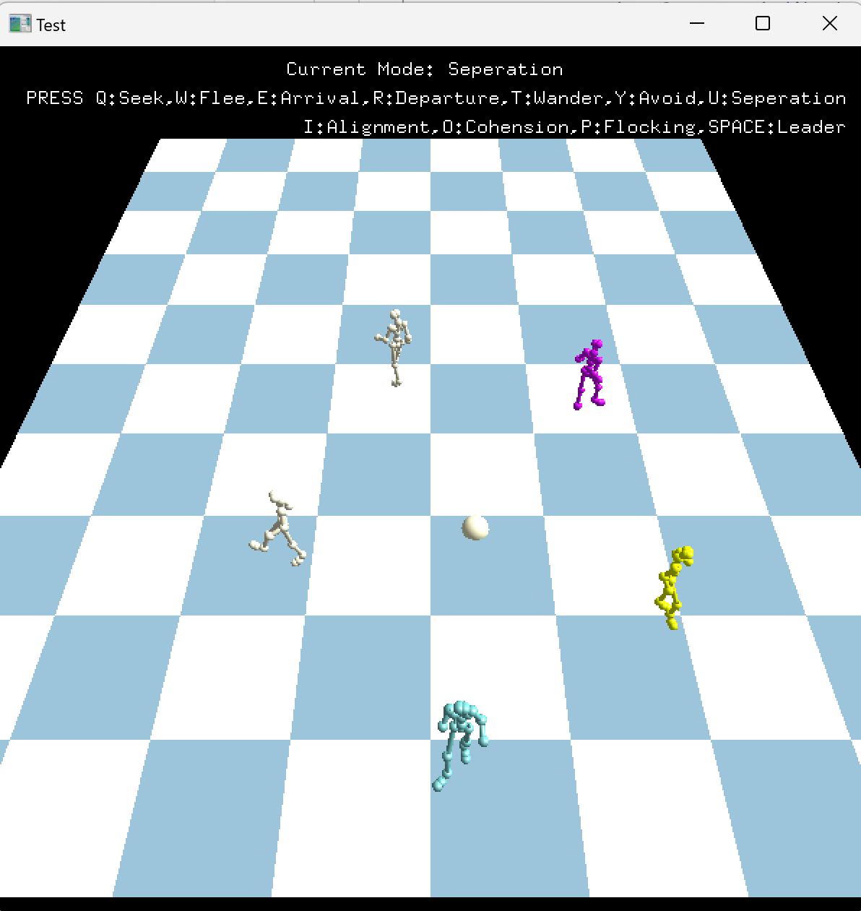

同时，我们提供了一个用来帮助进行调试的2DGUI。你可以将`BehaviorSimulation.py`中427行的`init()`注释，并取消注释掉426行的`Two_Dui()`，会得到一个更简洁的2D界面：

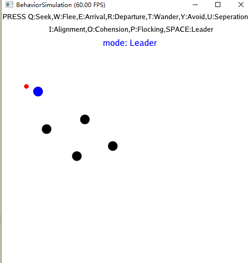

在`AgentConfig.py`中，提供了一系列的参数可用于对最终表现效果微调。

这是最后的挑战了，Good luck！
